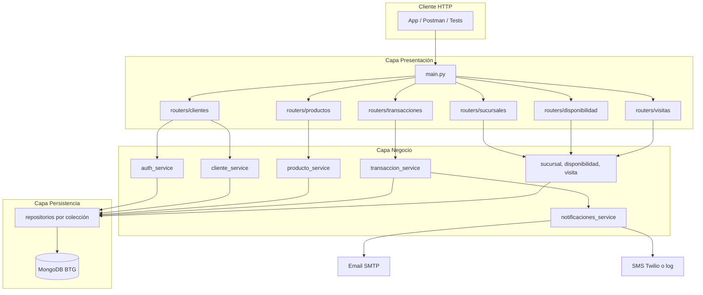
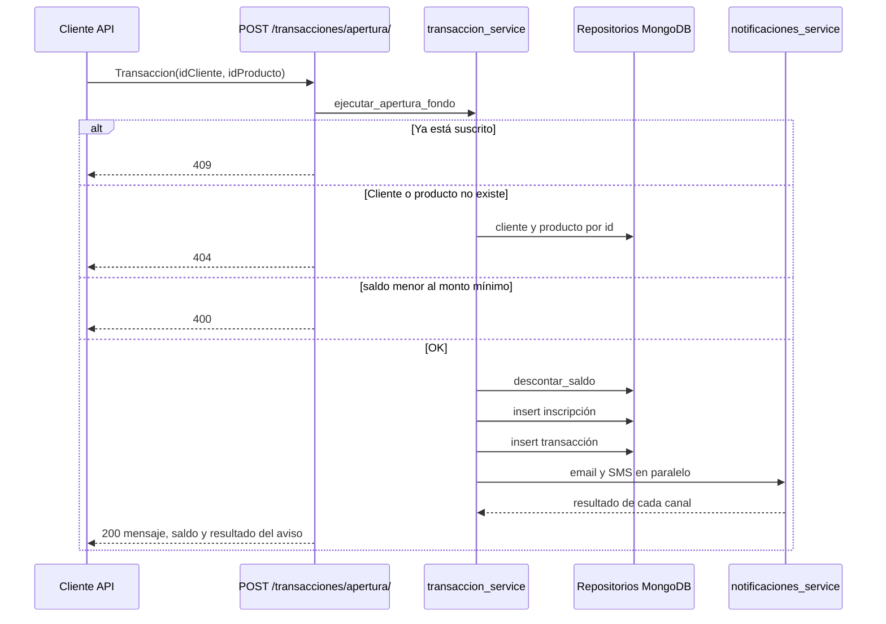
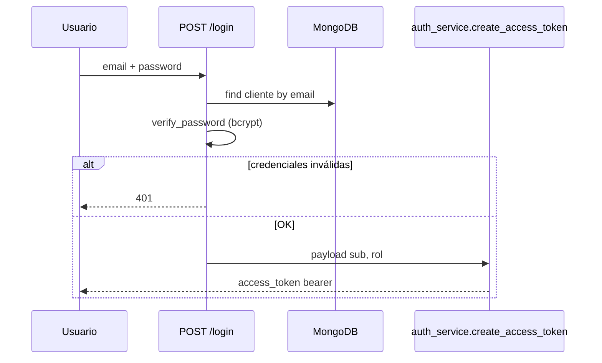
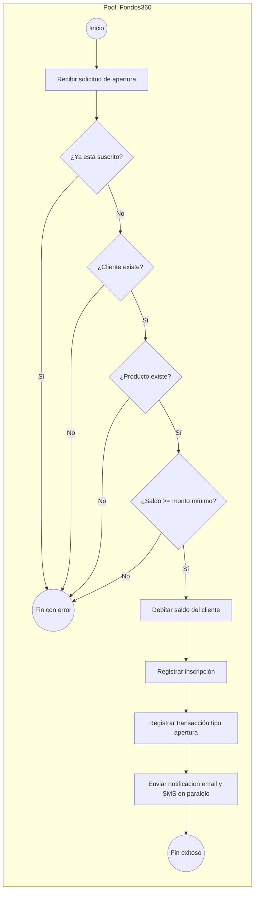
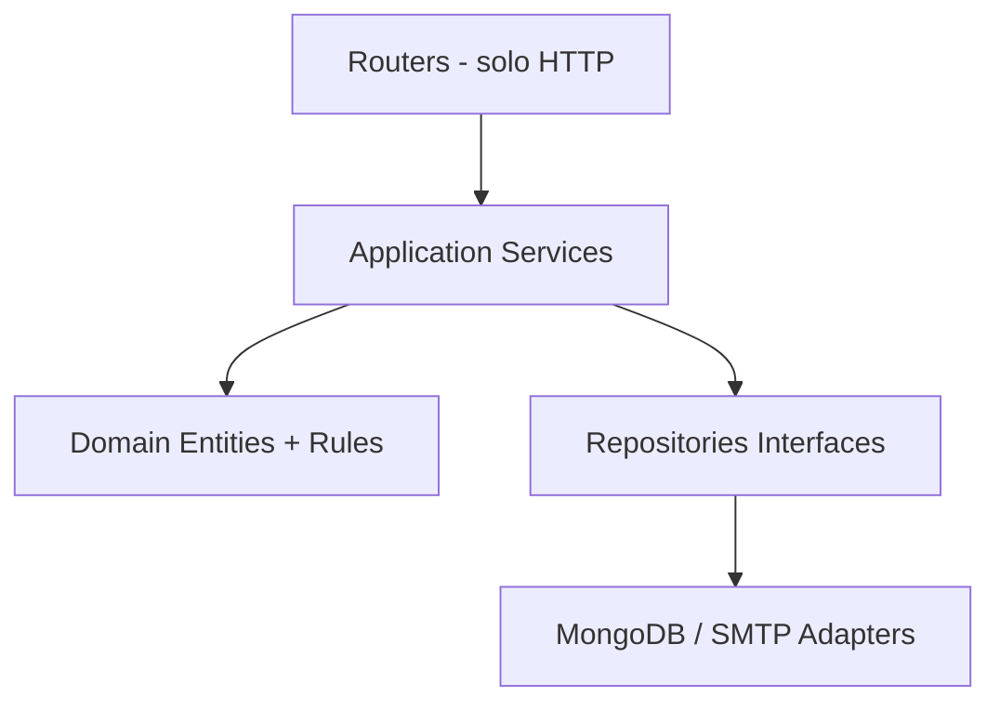

# Fondos360 — Arquitectura, flujos y roadmap

**Documento técnico** | Proyecto: API de gestión de fondos de inversión  
**Stack:** FastAPI · MongoDB · JWT · Pydantic · fastapi-mail · Twilio

---

## 1. Visión general del negocio

**Fondos360** es una API REST que modela la operación de un fondo de inversión (contexto BTG / fondos en Colombia):

| Dominio | Responsabilidad |
|---------|-----------------|
| **Clientes** | Registro, saldo, autenticación JWT, logout con revocación de tokens |
| **Productos** | Fondos (FPV, etc.) con monto mínimo de vinculación |
| **Transacciones** | Apertura (suscripción) y cancelación de fondos; historial |
| **Inscripciones** | Relación cliente–producto activa |
| **Sucursales** | Puntos físicos de atención |
| **Disponibilidad** | Qué productos ofrece cada sucursal |
| **Visitas** | Registro de visitas cliente–sucursal |

---

## 2. Descomposición por capas (arquitectura actual)

El proyecto implementa **arquitectura por capas**:

```
presentation → business → persistence → database
```

```
┌─────────────────────────────────────────────────────────────┐
│  PRESENTACIÓN (presentation/routers, schemas, dependencies) │
│  JWT via Depends, DTOs Pydantic, SlowAPI en /login          │
└──────────────────────────┬──────────────────────────────────┘
                           │
┌──────────────────────────▼──────────────────────────────────┐
│  NEGOCIO (business/services/)                               │
│  auth, cliente, producto, transaccion, disponibilidad, etc. │
└──────────────────────────┬──────────────────────────────────┘
                           │
┌──────────────────────────▼──────────────────────────────────┐
│  PERSISTENCIA (persistence/) — repositorios por colección   │
└──────────────────────────┬──────────────────────────────────┘
                           │
┌──────────────────────────▼──────────────────────────────────┐
│  DATABASE (database/config.py, connection.py) → MongoDB BTG │
└─────────────────────────────────────────────────────────────┘
```

### Estructura de carpetas

| Ruta | Rol |
|------|-----|
| `app/main.py` | Composition root, routers, lifespan, `/health` |
| `app/database/config.py` | Variables de entorno |
| `app/database/connection.py` | Cliente MongoDB |
| `app/database/transactions.py` | Transacción multi-documento o compensación |
| `app/presentation/routers/` | Endpoints HTTP |
| `app/presentation/schemas/` | DTOs Pydantic |
| `app/presentation/dependencies/` | JWT / RBAC (`Depends`) |
| `app/business/services/` | Reglas de negocio |
| `app/persistence/` | Repositorios PyMongo |
| `test/` | Pruebas espejo de capas (`database`, `persistence`, `business`, `presentation`) |

### Doble identificador en MongoDB

Los **clientes** usan dos IDs: `ObjectId` de MongoDB (`_id`) e `id` entero secuencial vía colección `counters` (`get_next_sequence_id_db`). Esto facilita APIs amigables pero añade complejidad en búsquedas y consistencia.

---

## 3. Flujo principal — Diagrama Mermaid

### 3.1 Arquitectura de capas y dependencias



### 3.2 Flujo de suscripción a fondo (apertura)



El `mensaje` de la respuesta es el cuerpo del correo y del SMS. El asunto del correo es `Suscripción Exitosa` o, en la cancelación, `Cancelación de Suscripción`. El aviso se envía antes de responder. Si falta el contacto de un canal, ese canal no sale.

### 3.3 Flujo de autenticación



---

## 4. Proceso de negocio — Diagrama BPMN

Representación BPMN del proceso **Suscripción a fondo de inversión**:



### Elementos BPMN (tabla)

| Elemento BPMN | Equivalente en código |
|---------------|------------------------|
| **Evento inicio** | `POST /transacciones/apertura/` |
| **Tarea** Recibir solicitud | Validación Pydantic `Transaccion` |
| **Gateway exclusivo** Ya suscrito | inscripción existente: HTTP 409 |
| **Gateway exclusivo** Cliente existe | `if not cliente: HTTP 404` |
| **Gateway exclusivo** Producto existe | `if not producto: HTTP 404` |
| **Gateway exclusivo** Saldo suficiente | `if saldo < monto_minimo: HTTP 400` |
| **Tarea** Descontar saldo | `cliente_repository.descontar_saldo` |
| **Tarea** Inscripción | `inscripcion_repository.insert` |
| **Tarea** Auditoría | `transaccion_repository.insert` |
| **Tarea** Notificar | `_post_event_notification` llama a email y SMS antes de responder |
| **Evento fin** | JSON con `transaccion_id`, `mensaje`, `nuevo_saldo`, `notificacion` |

**Nota:** Sin replica set, `_rollback_if_no_mongo_session` deshace a mano el saldo y la inscripción ya escritos. Con replica set, Mongo revierte la sesión y ese deshacer no corre.

---

## 5. Roadmap técnico (mejoras futuras)

Esta sección describe **evolución posible** del proyecto. Lo ya implementado aparece marcado como ✅.

### 5.1 Capa de dominio / aplicación

| Mejora | Estado | Beneficio |
|--------|--------|-----------|
| **`TransaccionService` en business** | ✅ | Lógica fuera de routers |
| **Repositorios por colección** | ✅ | PyMongo desacoplado de HTTP |
| **Unit of Work / transacciones MongoDB** | ✅ | Dev: rollback compensatorio; prod: `with_transaction` auto |
| **Observer email y SMS** | ✅ | El mismo evento llega a los dos canales antes de la respuesta |

### 5.2 Capa de presentación

| Mejora | Estado | Beneficio |
|--------|--------|-----------|
| **JWT en endpoints sensibles** | ✅ | RBAC admin/cliente vía `Depends` |
| **Catálogos de fondos GET públicos** | ✅ (decisión) | Consulta sin registro |
| **Paginación y filtros** | Pendiente | `skip/limit` en listados |
| **SlowAPI en `/login`** | ✅ | Rate limit 5/min |
| **SlowAPI global** | Pendiente | Rate limit en más endpoints |
| **`pydantic-settings`** | Pendiente | Config tipada desde `.env` |

### 5.3 Seguridad e infraestructura

| Mejora | Estado | Beneficio |
|--------|--------|-----------|
| **`SECRET_KEY` desde `.env`** | ✅ (plantilla `.env.example`) | Clave distinta en prod |
| **SMTP desde `.env`** | ✅ (plantilla) | Emails reales post-transacción |
| **Refresh tokens + rotación** | Pendiente | Sesiones más seguras |
| **RBAC admin/cliente** | ✅ | POST/DELETE catálogo de fondos solo admin |
| **Índices MongoDB** | ✅ | `(idCliente, idProducto)` único en inscripciones |
| **`/health`** | ✅ | Ping MongoDB |
| **CI (pytest + ruff)** | ✅ | `.github/workflows/ci.yml` |

### 5.4 Capa de persistencia

| Mejora | Estado | Beneficio |
|--------|--------|-----------|
| **`database/config` + `connection` unificados** | ✅ | Un solo cliente MongoDB |
| **ODM opcional** (Beanie) | Pendiente | Validación y relaciones más claras |
| **Migraciones** (scripts) | Pendiente | Esquema evolutivo controlado |

### 5.5 Producción — checklist

| Tema | Dev | Producción |
|------|-----|------------|
| **MongoDB** | Standalone local | Replica set para transacciones nativas |
| **Integridad financiera** | `$inc` atómico + rollback compensatorio | Preferir `with_transaction` con replica set |
| **SECRET_KEY** | Default `firma_token` aceptable | Variable obligatoria en `.env` |
| **SMTP** | Mockeado en tests | `MAIL_USERNAME`, `MAIL_PASSWORD`, `MAIL_FROM` reales |

### 5.6 Arquitectura objetivo (capas completas)



---

## 6. Funcionalidades de negocio innovadoras

| # | Funcionalidad | Descripción | Valor |
|---|---------------|-------------|-------|
| 1 | **Simulador de rentabilidad** | Proyección según categoría FPV y horizonte; no compromete saldo real | Educación financiera |
| 2 | **Aportes adicionales y retiros parciales** | Más allá de apertura/cancelación total | Producto real de fondos |
| 3 | **Portafolio consolidado** | Vista única: saldo libre + fondos activos + rendimiento estimado | UX tipo neobanco |
| 4 | **Alertas inteligentes** | Push/email si saldo bajo, vencimiento, o nuevo producto en sucursal cercana | Retención |
| 5 | **Scoring de elegibilidad** | Reglas KYC simplificadas antes de suscribir | Cumplimiento |
| 6 | **Programa de referidos** | Bonificación por invitar clientes con misma ciudad/sucursal | Crecimiento |
| 7 | **Agendamiento de visitas** | CRUD sobre `visitas` + disponibilidad de asesores por sucursal | Omnicanal |
| 8 | **Extractos PDF mensuales** | Historial `transacciones` + inscripciones | Formalidad regulatoria |
| 9 | **API de cotización en tiempo real** | Integración mock o real con valor cuota del fondo | Precisión contable |
| 10 | **Dashboard analítico B2B** | Métricas por sucursal: visitas, conversiones apertura | Decisiones comerciales |

---


## 7. Decisiones vigentes

### Catálogos públicos (decisión)

Los **GET** de productos, sucursales y disponibilidad **no exigen JWT** a propósito: un visitante puede consultar el catálogo antes de registrarse. Las operaciones de escritura (POST/DELETE) sí requieren rol **admin**; transacciones y datos de cliente requieren autenticación.

### Resuelto recientemente (continuación)

| Tema | Estado |
|------|--------|
| Disponibilidad GET por ObjectId + PUT actualizar | OK |
| `ENVIRONMENT=production` + validación `SECRET_KEY` | OK |
| Transacciones MongoDB nativas con replica set | OK |
| Aviso por email y SMS antes de la respuesta, mismo `mensaje` | OK |
| SMS vía Twilio; sin credenciales queda simulado en el log | OK |

---

## 8. Referencias de código clave

- Entrada: `app/main.py`
- Lógica financiera: `app/business/services/transaccion_service.py`
- Autenticación: `app/business/services/auth_service.py` + `app/presentation/routers/clientes.py`
- Persistencia: `app/persistence/` + `app/database/connection.py`

---

*Fondos360 - Arquitectura por capas.*
